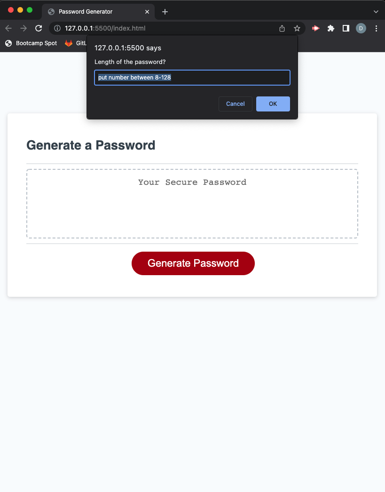
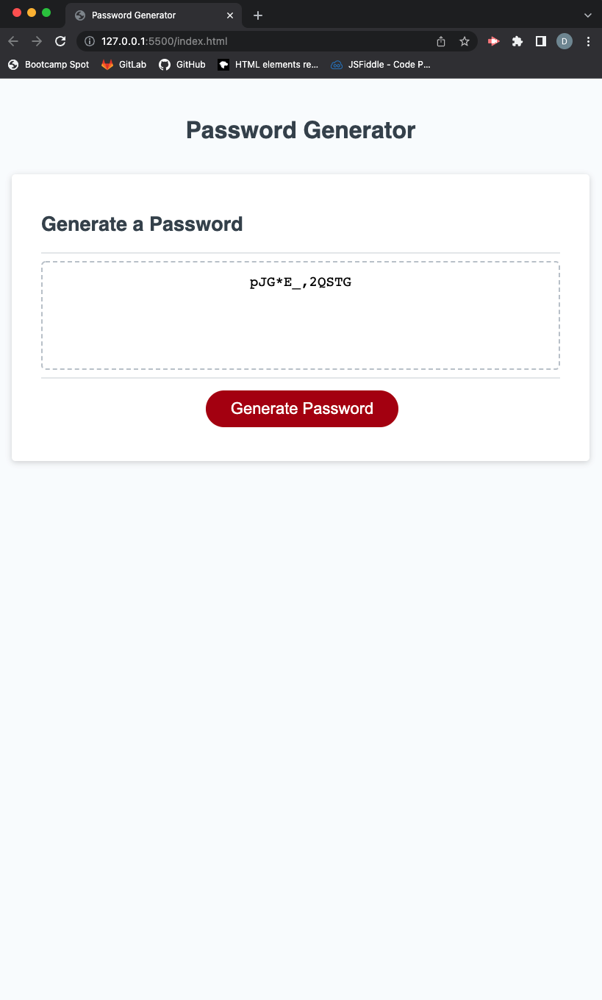

# hw-3-Javascript-password
## Password Generater
    * You can choose a length of password.
         -Length has to be greater than 8 and less than 128.
    * You can choose types of character (Lowercase/Uppercase/Symbols/Numbers).
         -It will ask you to choose at least one type of character.
    * Upon the selection, new secure password is generated and shown in the text box.

## Selection will be given via the window alert by clicking 'Generate Password' button.

## Generated password will be shown in the text box.

### Link to Github repository: https://github.com/daeunkim127/hw-3-Javascript-password.git
### Link to Webpage: https://daeunkim127.github.io/hw-3-Javascript-password/